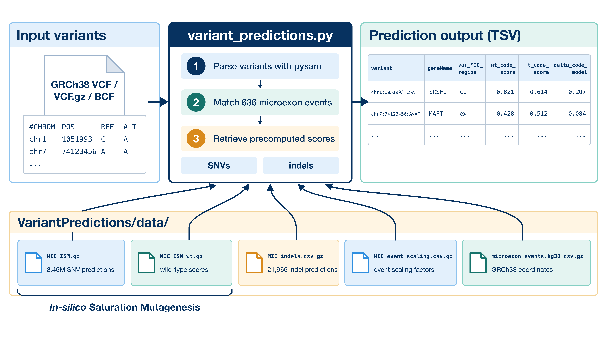

# Microexon code variant predictions



`variant_predictions.py` takes a GRCh38 VCF and returns precomputed microexon code-model scores for the variants it contains. Coverage is limited to 636 human microexons and five regions per event: the microexon itself (`ex`), the 300-nucleotide upstream and downstream intronic regions (`up` and `dn`), and 300-nucleotide windows around the two flanking splice sites (`c1` and `c2`). The script retrieves existing predictions without running the model.

## Installation

Install [Git LFS](https://git-lfs.com/), as it is required to download the prediction tables. Clone the repository and enter its root directory:

```bash
git clone https://github.com/geparada/microexon-regulatory-code.git
cd microexon-regulatory-code
```

Enable Git LFS for this repository and download the prediction tables:

```bash
git lfs install --local
git lfs pull
cd VariantPredictions
```

The `--local` option configures Git LFS only for this repository. Omit it to enable Git LFS for all repositories under your user account.

Create a Conda environment and install `pysam`, the script's only Python dependency:

```bash
conda create -n microexon-variant-predictions \
  -c conda-forge -c bioconda \
  python=3.11 pysam=0.24.1 -y
conda activate microexon-variant-predictions
```

## Quick test

Run the bundled example from the `VariantPredictions` directory:

```bash
python variant_predictions.py \
  --input-vcf examples/gnomad_v4.1_microexon_100.vcf \
  --output example_predictions.tsv
```

This writes `example_predictions.tsv`, which should match `examples/gnomad_v4.1_microexon_100.expected.tsv`. The example contains 100 gnomAD variants spanning 100 microexons, including 28 novel microexons. Eleven variants are indels. Most variants fall in the upstream or downstream intronic regions, and several illustrate large negative `delta_code_model` values.

Use `-h` to see all command-line options:

```bash
python variant_predictions.py -h
```

## Delta-score scaling

By default, the script returns `delta_code_model` values calculated with event-specific scaling factors recalculated across the expanded set of variants in Supplementary Table 12 of our paper:

```bash
python variant_predictions.py \
  --input-vcf variants.vcf.gz \
  --output predictions.tsv
```

To obtain values on the scale used in the paper's main analyses, add `--delta-scaling main-analysis`:

```bash
python variant_predictions.py \
  --input-vcf variants.vcf.gz \
  --output predictions.main_analysis.tsv \
  --delta-scaling main-analysis
```

The `main-analysis` mode uses the original scaling factors from the paper's main analyses. Applying these factors to additional variants can produce scores below -1 or above 1. The default `all-variants` mode uses factors recalculated from all raw code-model predictions in the expanded table, keeping scores between -1 and 1.

Both modes write the selected factor and score to the `logit_scaling_factor` and `delta_code_model` output columns. These column names stay the same regardless of the mode selected.

## Input VCF

The script accepts plain VCF, BGZF-compressed VCF, and BCF files, with or without sample columns. Multiallelic records are supported; each ALT allele is evaluated separately.

- Coordinates must use GRCh38/hg38.
- Chromosome names with or without the `chr` prefix are accepted.
- Indels must be left-aligned and normalized to match a precomputed `chrom:position:REF:ALT` representation exactly.
- Symbolic alleles and multi-nucleotide substitutions are reported as unsupported when they overlap a covered region.

Variants outside the covered regions are omitted. Within coverage, an allele without a precomputed prediction receives `NA` in the score fields. Each matching microexon and region produces a separate output row, so a single allele may appear more than once.

To normalize an input VCF with `bcftools`:

```bash
bcftools norm \
  -f /path/to/hg38.fa \
  -m -any input.vcf.gz \
  -Oz -o input.normalized.vcf.gz
```

## Optional reference check

To validate REF alleles against the hg38 genome, provide an indexed FASTA with `--reference-fasta`. This check is optional and applies to variants that overlap the covered regions:

```bash
python variant_predictions.py \
  --input-vcf variants.vcf.gz \
  --output predictions.tsv \
  --reference-fasta /path/to/hg38.fa
```

The FASTA must have a `.fai` index, which can be created with `samtools faidx`. If a REF allele does not match the genome, the script prints a warning and writes `ERROR` in the prediction fields for that match. Processing continues with the remaining records.

## Output

The output is a tab-separated table with one row per ALT allele, microexon event, and matched region. The main columns follow the names and order of the code-model fields in Supplementary Table 12 of our paper.

| Column | Description |
|---|---|
| `variant` | Variant in `chrom:position:REF:ALT` format, with a 1-based VCF position. |
| `geneName` | Gene symbol associated with the microexon. |
| `var_type` | `SNV`, `Indel`, or `Unsupported`. |
| `event` | Microexon event identifier. |
| `ME-ID` | Genomic microexon identifier. |
| `MIC_group` | `known_mic` or `new_mic`. |
| `MIC_dist` | Position relative to the relevant microexon or splice-site anchor, using the convention in Supplementary Table 12. |
| `var_MIC_region` | Matched region: `c1`, `c2`, `up`, `dn`, or `ex`. |
| `mt_code_score` | Raw code-model probability for the alternate sequence. |
| `wt_code_score` | Raw code-model probability for the wild-type sequence. |
| `logit_scaling_factor` | Event-specific factor selected by `--delta-scaling`; the default is the factor recalculated across all variants. |
| `delta_code_model` | Change in log2 odds divided by the selected `logit_scaling_factor`. |
| `assembly` | `hg38`. |
| `VCF_ID` | ID copied from the input VCF. |
| `prediction_status` | `FOUND`, `NA_NOT_PRECOMPUTED`, or an explicit `ERROR_*` value. |
| `ref_ok` | `NA` when no FASTA was requested, otherwise `True`, `False`, `ERROR`, or `NOT_RUN`. |

A positive `delta_code_model` indicates an increase in the model score relative to wild type; a negative value indicates a decrease. These values describe predicted effects on the model score. They are not calibrated measures of pathogenicity and should not be used alone for clinical interpretation.

## Bundled data files

The `data/` directory contains the five gzip-compressed CSV files used by `variant_predictions.py`: single-nucleotide substitution scores, wild-type scores, precomputed indel effects, event-level scaling factors, and genomic annotations for 636 microexon events. The files can also be used directly in custom pipelines. See the [data README](data/README.md) for complete table descriptions, column definitions, coordinate conventions, and guidance for custom lookups.

## Citation

If you use these predictions, please cite the associated paper:

> Parada, G. E. *et al.* A microexon regulatory code reveals autism-linked genetic variation. *Nature* (2026). [https://doi.org/10.1038/s41586-026-11119-w](https://doi.org/10.1038/s41586-026-11119-w)

The code archive cited in the paper has the Zenodo DOI [10.5281/zenodo.21940006](https://doi.org/10.5281/zenodo.21940006).
